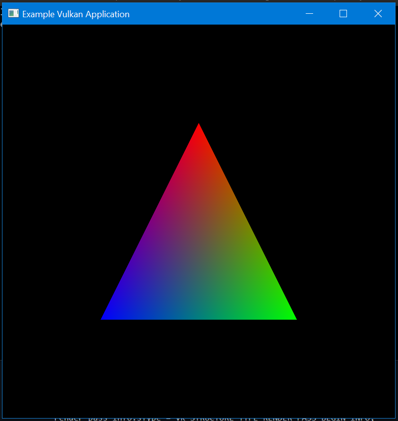

# vk-bootstrap-study

Recreation of [vk-bootstrap/example/triangle.cpp](https://github.com/charles-lunarg/vk-bootstrap/blob/c16de538149069c81cfbbab74f278f703beddb7b/example/triangle.cpp) from [vk\-bootstrap/triangle\.cpp at master · charles\-lunarg/vk\-bootstrap](https://github.com/charles-lunarg/vk-bootstrap/blob/master/example/triangle.cpp) using [vulkan_raii.hpp](https://github.com/KhronosGroup/Vulkan-Hpp/blob/429c4c522c65d10ec6df4633a1b78fc28aca7dc3/vulkan/vulkan_raii.hpp) by comparing the logic with snippets from [Vulkan-Hpp/RAII_Samples/](https://github.com/KhronosGroup/Vulkan-Hpp/tree/6fe966c6d985bab4d97bdaa55e1e97ea9dd4aec9/RAII_Samples)

See [Vulkan\-Hpp/vk\_raii\_ProgrammingGuide\.md at master · KhronosGroup/Vulkan\-Hpp](https://github.com/KhronosGroup/Vulkan-Hpp/blob/master/vk_raii_ProgrammingGuide.md)

Very similar to `vk-bootstrap-study` but splits the logic into `VulkanContext`, `AppSettings`, `Image`, `Window` classes.

