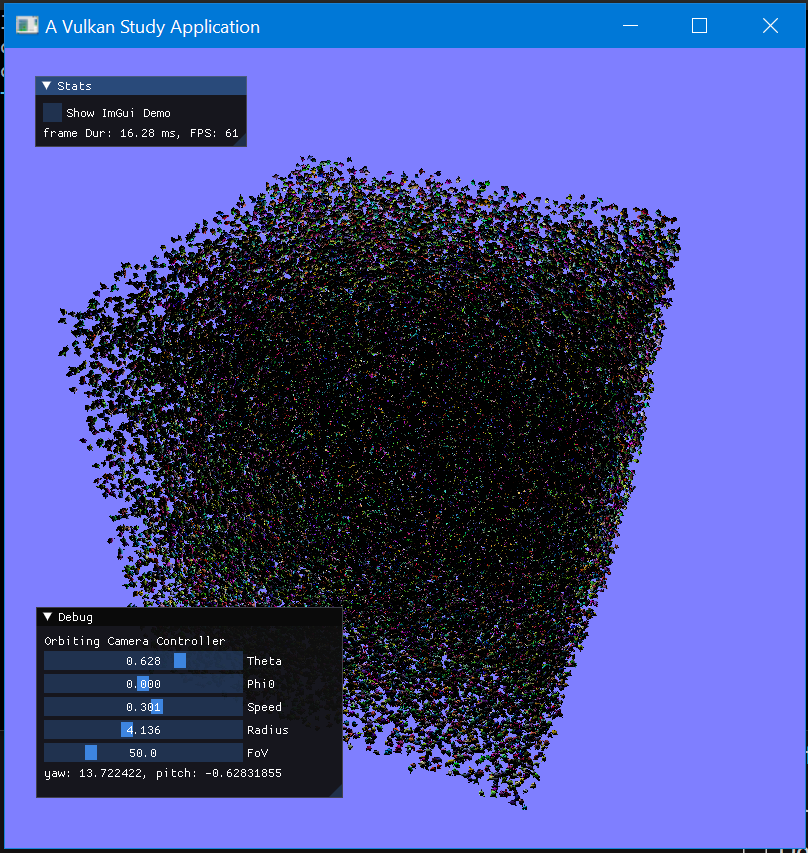
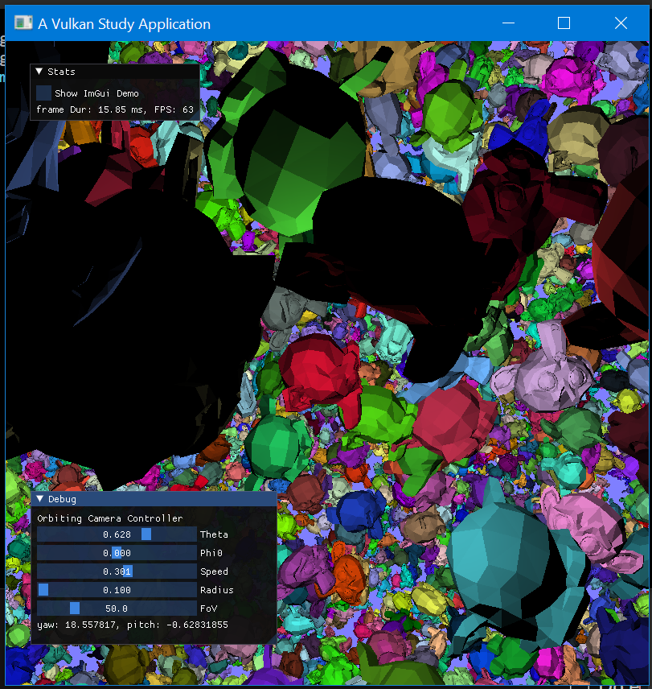
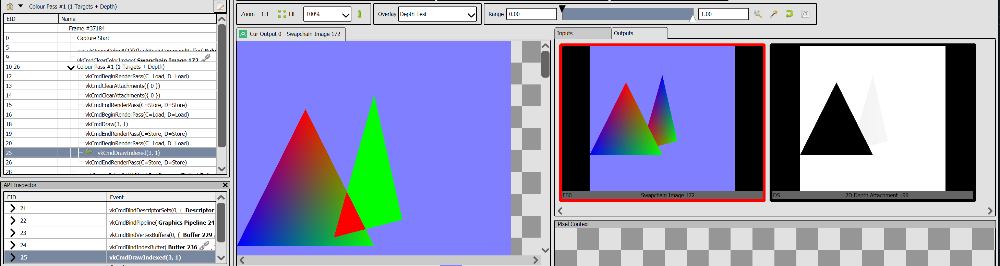

# Vulkan Studies

A [vulkan_raii.hpp](https://github.com/KhronosGroup/Vulkan-Hpp/) app to study Vulkan.

* My Vulkan Object abstractions are in `vku` namespace under `vku/` folder.
  * Most important class is `VulkanContext`.
    * It initializes Vulkan
    * gets physical and logical devices
    * creates swapchain (with its imageviews, framebuffers etc)
    * One graphics and one present queues (stores their family indices too)
    * Creates a RenderPass that's compatible with Swapchain's Framebuffer
    * RenderPass does not do clearing at beginning, and does NOT change image layout to Present at end
    * Also provides `drawFrameBegin()` and `drawFrameEnd()` methods.
      * They hide synchronization logic.
      * Begin calculates currentFrame (in frames-in-flight setup) and imageIndex (the index of Swapchain image that is used among N of them (N=3))
      * Begin returns a simple struct, `FrameDrawer` that has current CommandBuffer, current Image etc.
      * The idea is to sandwich further RenderPasses between Begin and End and fill CommandBuffer with drawcalls
  * `SpirVHelper`
    * Has logic for compiling GLSL to SPIRV on-the-fly and makes a ShaderModule
  * `utils.hpp`
    * Tells whether it's a Debug or Release build via `isDebugBuild` namespace variable
    * and has other helpers, for now `setImageLayout` that creates pipeline barriers for image layout transitions
  * `Image` is what you'd expect
    * a struct that holds `vk::Format`, `vk::raii::Image`, `vk::raii::DeviceMemory`, `vk::raii::ImageView` which are usually used together.
  
StudyApp that'll run individual studies (aka Layer, aka Sample)

* A study is an abstract class with `init`, `recordCommandBuffer` and `deinit` functions.
  * record method will be given the `VulkanContext` and `FrameDrawer` using which individual concrete `Study`s will implement their
* has a `list` of `Study`s. and push pop methods to add remove `Study`s.
* `run` method starts the Study app and goes into main loop.

Usage:

```c++
int main() {
  vku::StudyRunner sr;
  sr.pushStudy(std::make_unique<MyStudy>());
  sr.pushStudy(std::make_unique<YourStudy>());
  sr.run();
}
```

## Screenshots

Study5: Instancing. 50K monkeys




Two studies superimposed, analyzed in RenderDoc:


## References

* [Vulkan\-Hpp/vk\_raii\_ProgrammingGuide\.md at master � KhronosGroup/Vulkan\-Hpp](https://github.com/KhronosGroup/Vulkan-Hpp/blob/master/vk_raii_ProgrammingGuide.md)
